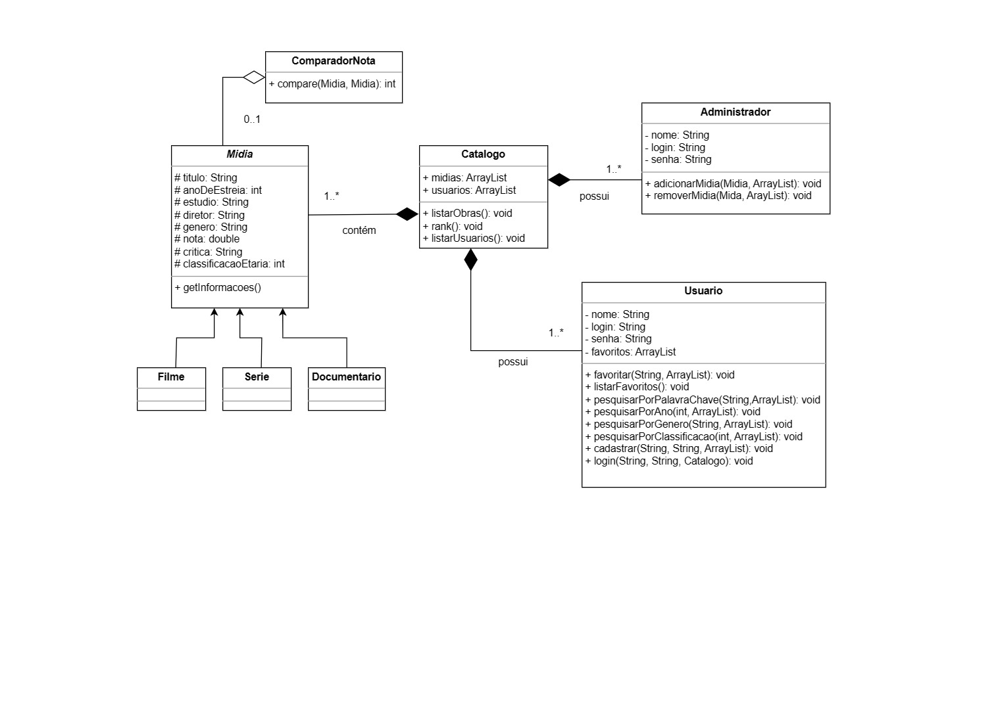

# Catalogo-de-Filmes
Projeto feito em Java para a disciplina de Programação Orientada a Objetos.

## Descrição
Um catalogo para consulta que armazena informações a respeito de filmes, series e documentários. Nele é possível fazer pesquisas por titulos, data de estreia, genêro e outros, encontrando uma descrição da midia (titulo, diretor, estudio, ano de estreia, genêro e faixa etária) desejada.

Existem dois tipos de usuários: o administrador e o usuário comum.
Sendo que o administrador tem a permissão para adicionar, remover e editar informações das obras no catalogo. O usuário é quem faz a consulta pela obra desejada e visualiza suas informações. Ambos tem suas informações de login e precisam efetua-lo para usar o catalogo de filmes.

Pretendo futuramente implementar um banco de dados para guardar as obras e um site para vizualizar o catalogo.

